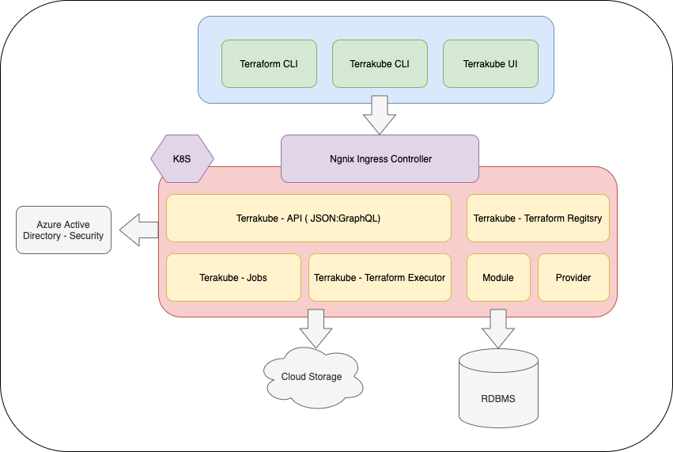

# 📐 Architecture

This is the high level architecture of the platform

Component descriptions:

* Terrakube API:&#x20;
  * Expose a JSON:API or GraphQL API providing endpoints to handle:
    * Organizations.
    * Workspaces (Variables, Environment Variables and Terraform state changes history).
    * Jobs.
    * Modules.
    * Providers.
    * Teams.
    * Teamplate
* Terrakube Job:
  * Automatic process that check for any pending job operations in any workspace&#x20;
* Terrakube Executor:
  * Service that executes the terraform operations, updates the status using the Terrakube API and save the results using different cloud storage providers, it uses the Terrakube configuration language to customize the jobs flows with different steps using internal or external tools
* Terrakube Open Registry:
  * Open Source terraform registry with support for the module, provider and login protocol.
* Cloud Storage:
  * Cloud storage to save the terraform state and terraform outputs.
* RDBMS:
  * The platform can be used with any database supported by the Liquibase project.
* Security:&#x20;
  * To handle authentication the platform uses Azure Active Directory.
* Terrakube CLI:
  * Go based CLI that can communicate with the Terrakube API and execute operation for organizations, workspaces, jobs, modules or providers
* Terrakube UI:
  * React based frontend to handle all Terrakube Operations.
