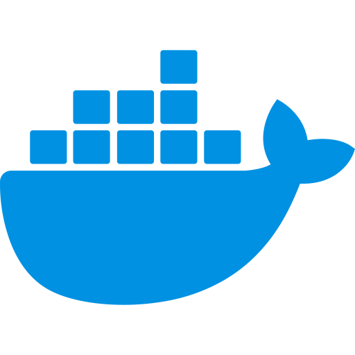

# Azure DevOps

To connect Terrakube to Azure DevOps and use private git repositories you will need to follow these steps:

### Step 1 - Register OAuth Application

Use the following [link](https://aex.dev.azure.com/app/register?mkt=en-US) to create a new OAuth Application inside Azure DevOps Services

Complete the following fields:

* Company name
* Application name
* Application website
* Authorization callback URL


For authorization callback you can use http://localhost, we will update this value later.


Example:



Add the followings "Authorized scopes" and create the application:

* Code (Read)
* Code (Status)

Example:

.png>)

After creating the application copy the following values:

* App Id
* Client Secret

### Step 2 - Create a new VCS Connection

Create a new VCS connection using the following values:

* clientId = App ID
* clientSecret = Client Secret
* vcsType = AZURE\_DEVOPS


Please refer to [VCS API ](../api/methods/vcs.md)for more information



You can also use Terrakube CLI or Terrakube UI to generate the VCS record.


Make sure to copy the VCS id from the response body.

### Step 3 - Update OAuth Application Callback

Update the application callback using the following structure:

```
https://{{TerrakubeApiURL}}/callback/v1/vcs/{{vcsId}}
```

### Step 4 - Authorize OAuth Application

Visit the following link

```
https://app.vssps.visualstudio.com/oauth2/authorize?client_id={{appId}}&redirect_uri={{appCallback}}&response_type=Assertion&scope=vso.code+vso.code_status
```

Make sure to replace the values:

* app\_id = Client Id from step 1
* redirect\_uri = Application callback from step 3

### Step 5 - Authorize Application

 (1).png>)

If the setup was successful you should see this message in your browser.

```
Connected 
```
